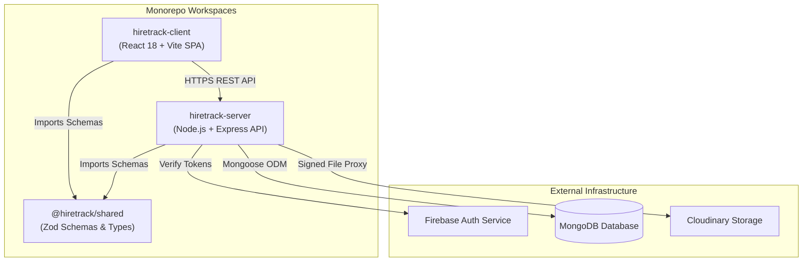
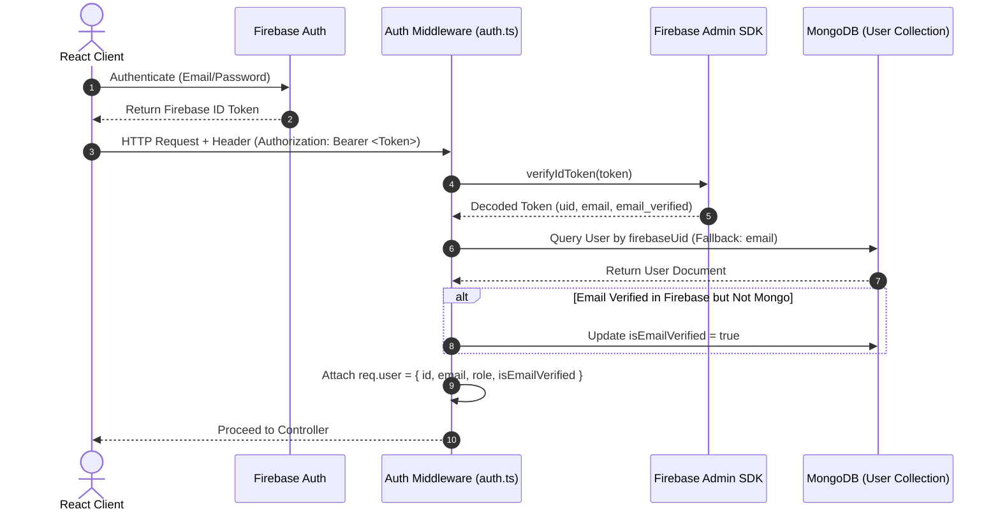
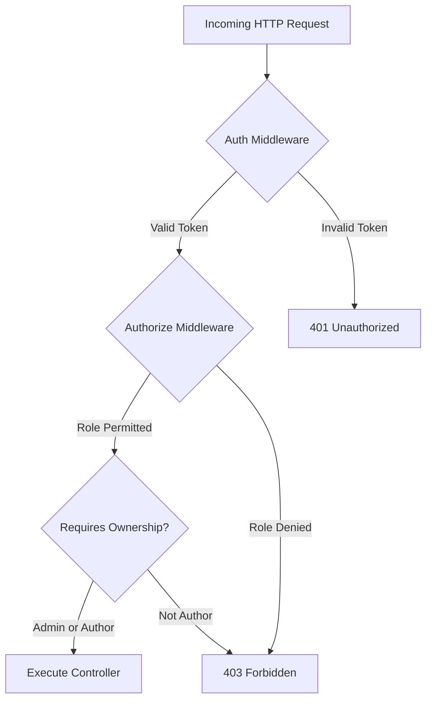
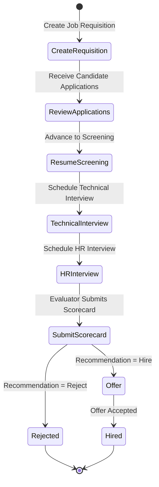
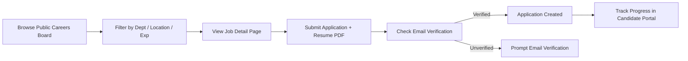
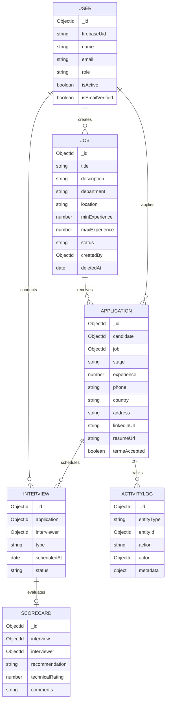
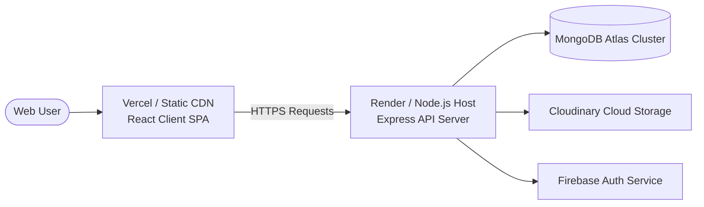

# HireTrack — System Architecture & Technical Specifications

## 1. High-Level Architecture Overview

HireTrack is built as an npm workspaces monorepo comprising three distinct packages:
- `@hiretrack/shared`: Shared Zod validation schemas and TypeScript type definitions.
- `hiretrack-server`: Node.js + Express REST API server written in TypeScript.
- `hiretrack-client`: React 18 SPA compiled with Vite.



---

## 2. Folder Structure

```text
HireTrack/
├── packages/
│   └── shared/
│       ├── src/
│       │   ├── index.ts              # Schema exports & types
│       │   ├── schemas/              # Zod schemas (Apply, Job, Scorecard, etc.)
│       │   └── types/                # TypeScript interface definitions
│       └── package.json
├── server/
│   ├── src/
│   │   ├── config/                   # DB, Firebase, Cloudinary configurations
│   │   ├── controllers/              # API controllers (auth, job, application, etc.)
│   │   ├── middleware/               # Auth, RBAC, upload, rate-limit middleware
│   │   ├── models/                   # Mongoose schemas & interfaces
│   │   ├── routes/                   # Express route definitions
│   │   ├── scripts/                  # DB seed script
│   │   ├── test/                     # Vitest integration test suites
│   │   └── index.ts                  # Express application entrypoint
│   └── package.json
├── client/
│   ├── src/
│   │   ├── components/               # Reusable UI & layout components
│   │   ├── context/                  # React Auth & Workspace contexts
│   │   ├── hooks/                    # Custom hooks (useDebounce, searchParams, etc.)
│   │   ├── pages/                    # Views (Careers, Recruiter Workspace, Admin, etc.)
│   │   ├── types/                    # Frontend specific types
│   │   └── main.tsx                  # React entrypoint
│   ├── public/                       # Static assets (sitemap.xml, favicon)
│   └── package.json
└── package.json                      # Monorepo root configuration
```

---

## 3. Authentication & Identity Flow

Authentication combines Firebase Auth for client token issuance with server-side MongoDB identity resolution.



---

## 4. Role-Based Access Control (RBAC) Architecture

Route protection uses a layered middleware chain: authentication verification, role checking, and row-level ownership validation.



- **Role Levels**:
  - `candidate`: Can view public jobs, submit applications, and access personal candidate portal.
  - `recruiter`: Can manage requisitions, advance application stages, record candidate notes, and schedule interviews.
  - `admin`: Full administrative access, including recruiter account management, job creation, and scorecard submission.

---

## 5. Workflow Architecture

### Recruiter Workflow Architecture



### Candidate Workflow Architecture



---

## 6. Analytics Aggregation Pipeline

Executive metrics are aggregated from MongoDB collections using single-pass pipeline queries in `analyticsController.ts`:

- **Active / Closed Requisitions**: Computed via `Job.countDocuments({ status, deletedAt: null })`.
- **Stage Distribution**: Aggregated via `$group` pipeline on `Application.stage`.
- **Offer Acceptance Rate**: Computed as $\frac{\text{Hired}}{\text{Hired} + \text{Offers Pending}} \times 100$.
- **Average Time to Hire**: Calculated by measuring the date difference ($\text{updatedAt} - \text{createdAt}$) for applications in `hired` stage.
- **Stale Application Alerts**: Queries active applications where `updatedAt` is older than 7 days.

---

## 7. Database Schema & Data Modeling



---

## 8. API Architecture

API endpoints follow RESTful design patterns:

| Resource | Method | Endpoint | Authorization | Description |
| :--- | :--- | :--- | :--- | :--- |
| **Auth** | `POST` | `/api/auth/register` | Public | Candidate self-registration |
| | `POST` | `/api/auth/verify-email` | Authenticated | Trigger email verification |
| **Jobs** | `GET` | `/api/jobs` | Public | List open job postings |
| | `POST` | `/api/jobs` | Recruiter / Admin | Create new job requisition |
| | `PUT` | `/api/jobs/:id` | Author / Admin | Update requisition details |
| | `DELETE`| `/api/jobs/:id` | Author / Admin | Soft-delete job requisition |
| **Applications** | `POST` | `/api/applications` | Candidate | Submit job application + resume PDF |
| | `GET` | `/api/applications/manage` | Recruiter / Admin | List manage applications pipeline |
| | `POST` | `/api/applications/:id/advance` | Recruiter / Admin | Advance application stage |
| | `POST` | `/api/applications/:id/reject` | Recruiter / Admin | Reject application with reason |
| | `GET` | `/api/applications/:id/resume` | Authenticated | Stream signed resume PDF |
| **Interviews** | `POST` | `/api/interviews` | Recruiter / Admin | Schedule interview session |
| | `GET` | `/api/interviews/admin` | Admin | Get interviewer assigned queue |
| **Scorecards** | `POST` | `/api/scorecards/interview/:id` | Admin | Submit interview scorecard |
| **Analytics** | `GET` | `/api/analytics/dashboard` | Recruiter / Admin | Retrieve executive analytics |

---

## 9. Deployment Architecture



- **Client Hosting**: Single Page Application static bundle served via Vercel / static CDN.
- **Server Hosting**: Node.js environment hosted on Render / Railway executing compiled TypeScript JavaScript (`dist/index.js`).
- **Database**: MongoDB Atlas cloud cluster with automated index management.

---

## 10. Security Architecture

- **Token Security**: Server-side Firebase ID token verification on every protected request.
- **Row-Level IDOR Protection**: Verification checks ensuring non-admin recruiters cannot alter requisitions authored by other recruiters.
- **Duplicate Application Guard**: Compound unique database index `{ candidate: 1, job: 1 }` preventing active duplicate applications.
- **File Upload Safety**: Multer memory buffer processing restricting file types to `application/pdf` under 5MB, preventing local disk file inclusion.
- **HTTP Header Hardening**: Helmet integration setting `X-Content-Type-Options: nosniff`, `X-Frame-Options: DENY`, and Content Security Policy headers.
