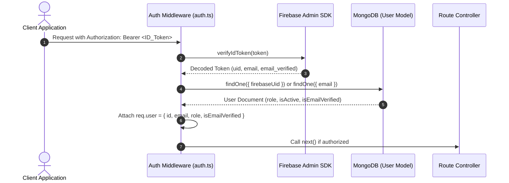

# HireTrack Case Study

## 1. Executive Summary

HireTrack is a single-company B2B Applicant Tracking System (ATS) engineered as a type-safe MERN monorepo using npm workspaces (`@hiretrack/shared`, `server`, `client`). The platform unifies candidate sourcing, multi-stage pipeline management, interview scheduling, evaluator scorecards, and executive analytics into a single web application.

Built as part of the Digital Heroes Full Stack Developer Trial, HireTrack addresses common software recruitment bottlenecks by enforcing strict role-based access control (RBAC), end-to-end Zod schema validation, real-time database aggregation pipelines, and deterministic candidate state transitions. The project contains 37 automated integration tests with 100% pass rate and zero TypeScript compilation errors under strict mode.

---

## 2. Problem Statement

### Recruitment Workflow Challenges
Talent acquisition teams at growing technology companies often manage hiring across fragmented communication channels. Resumes arrive via email, candidate status updates are tracked in static spreadsheets, and interviewer feedback is scattered across chat messages. This fragmenting leads to:
- Missing candidate history and lost applicant records.
- Difficulty tracking candidate movement across interview stages.
- Risk of unauthorized access to sensitive applicant contact details and salary data.

### Manual Hiring Bottlenecks
Manual administrative steps slow down hiring speed:
- Recruiters must manually update candidate statuses across multiple tracking documents.
- Technical interview scheduling requires manual email coordination between candidate and interviewer schedules.
- Evaluating recruitment health (such as time-to-hire, offer acceptance rate, or candidate drop-off) requires manual spreadsheet calculations prone to human error.

### Goals
1. Engineer a single-company ATS that streamlines candidate sourcing, application processing, pipeline stage transitions, interview bookings, and evaluator scorecards.
2. Enforce server-side security boundaries (RBAC, row-level ownership validation, and duplicate application prevention).
3. Compute all executive metrics and pipeline statistics dynamically from live database records without relying on hardcoded mock values.

---

## 3. Solution Overview

### High-Level Architecture
HireTrack is structured as a monorepo containing three npm workspace packages:

```text
HireTrack Monorepo
├── packages/shared/     # Centralized Zod validation schemas & TypeScript interfaces
├── server/              # Node.js + Express + TypeScript REST API
└── client/              # React 18 + Vite + TypeScript Single Page Application
```

### Technologies
- **Frontend**: React 18, Vite, React Router DOM, Lucide Icons, CSS Modules / Vanilla CSS.
- **Backend**: Node.js, Express.js, TypeScript (`strict: true`), Mongoose ODM.
- **Database**: MongoDB Atlas / local MongoDB instance with compound text and relational indexes.
- **Authentication**: Firebase Admin SDK server-side token verification with MongoDB identity sync.
- **Validation & Testing**: Zod validation schemas, Vitest integration test framework.

### Why MERN
The MERN stack (MongoDB, Express, React, Node.js) provided full-stack JavaScript/TypeScript unification. React's component model enables dynamic views (Kanban pipeline boards, interactive filters, analytics charts), while Express handles lightweight HTTP routing. TypeScript across all layers ensures that data structures returned by MongoDB match component props.

### Why Firebase
Firebase Auth offloads client-side identity management and token issuance. The Express backend verifies Firebase ID tokens server-side via `firebase-admin`, mapping authenticated Firebase UIDs to Mongoose `User` documents. This approach provides authentication while keeping backend authorization logic fully under application control.

### Why MongoDB
Document-oriented storage fits recruitment data models. Candidate applications contain embedded arrays (notes, timeline activity logs, interview links) and variable metadata. MongoDB's aggregation framework allows complex metrics (stage distributions, average time-to-hire, stale candidate counts) to be computed directly in database queries.

---

## 4. System Architecture

```mermaid
graph TD
    Client[React 18 + Vite Client] -->|HTTP / Bearer Token| Server[Node.js + Express API Server]
    Server -->|Validation| Shared[@hiretrack/shared Zod Schemas]
    Server -->|Verify ID Token| Firebase[Firebase Admin SDK]
    Server -->|ODM Queries & Aggregations| Mongo[(MongoDB Database)]
    Server -->|Signed File Download| Cloudinary[Cloudinary Storage]
```

### Frontend Architecture
The frontend is a React 18 SPA built with Vite. It features role-specific user workspaces:
- **Public Portal**: Unauthenticated job board, detailed requisition pages, and candidate application forms.
- **Recruiter Workspace**: Kanban pipeline board, candidate search/filters, note logs, stage advancement controls, and interview scheduling modals.
- **Admin Console**: Executive analytics dashboard, recruiter user management, and interview management queue.

### Backend Architecture
The backend is an Express API server written in TypeScript. Routes are organized by domain resources (`/api/auth`, `/api/jobs`, `/api/applications`, `/api/interviews`, `/api/scorecards`, `/api/users`, `/api/analytics`). Controllers validate incoming payloads using `@hiretrack/shared` Zod schemas before interacting with Mongoose models.

### Database Architecture
Data storage consists of six primary Mongoose collections:
- `User`: User profiles containing `firebaseUid`, `email`, `role` (`admin`, `recruiter`, `candidate`), `isActive`, and `isEmailVerified`.
- `Job`: Job requisitions with `title`, `description`, `department`, `location`, `minExperience`, `maxExperience`, `status` (`open`, `closed`), `createdBy`, and `deletedAt`.
- `Application`: Candidate applications linked to `candidate` and `job`, with `stage`, `experience`, `phone`, `country`, `address`, `linkedinUrl`, and `resumeUrl`.
- `Interview`: Scheduled interview sessions linking `application` and `interviewer`, with `type` (`technical`, `hr`), `scheduledAt`, and `status`.
- `Scorecard`: Evaluator feedback containing `interview`, `interviewer`, `recommendation` (`pass`, `fail`, `hire`, `reject`), ratings, and comments.
- `ActivityLog`: Audit log tracking entity changes (`entityType`, `entityId`, `action`, `actor`, `metadata`).

### Authentication & RBAC Flow



### Analytics Pipeline Architecture
The analytics controller (`analyticsController.ts`) aggregates pipeline metrics directly from MongoDB without static fallbacks:
- `totalActiveJobs` and `closedJobsCount` via `Job.countDocuments()`.
- `totalApplications` and `activeCandidates` via `Application.countDocuments()`.
- `stageDistribution` histogram calculated via MongoDB `$group` on `stage`.
- `offerAcceptanceRate` calculated as $\frac{\text{Hired}}{\text{Hired} + \text{Offers Pending}} \times 100$.
- `needsAttention` list generated by querying active applications where `updatedAt` is older than 7 days.

---

## 5. Core Features

### Authentication
- Self-registration for candidate accounts (`role: 'candidate'`).
- Firebase ID token verification backed by MongoDB user synchronization.
- Candidate email verification enforcement gating job application submission.
- Password reset token generation (SHA-256 single-use hashes with 30-minute expiry).

### ATS Pipeline State Machine
Candidate movement follows a defined stage lifecycle:
1. `applied`: Initial stage upon resume submission.
2. `resume_screening`: Candidate under recruiter review.
3. `technical_interview_scheduled`: Technical interview date booked.
4. `technical_interview_completed`: Technical scorecard submitted.
5. `hr_interview_scheduled`: HR interview date booked.
6. `hr_interview_completed`: HR scorecard submitted.
7. `offer`: HR recommendation set to `hire`.
8. `hired` / `rejected`: Terminal pipeline states.

### Resume Management
- Multipart form parsing using Multer memory storage.
- Strict PDF mimetype validation and 5MB file size restriction.
- Resume streaming proxy endpoint (`GET /api/applications/:id/resume`) generating signed Cloudinary URLs (5-minute expiry) to prevent direct public access to private file buckets.

### Recruiter Workspace
- Dual view: Interactive Kanban board and tabular list view.
- Real-time text search debounced at 300ms.
- Stage advancement and candidate rejection modals with standardized rejection reason logging (`skills_mismatch`, `salary_expectations`, `location_unsupported`, `culture_fit`, `other`).

### Candidate Portal
- Dedicated workspace showing all active applications submitted by the candidate.
- Real-time stage progress indicators and scheduled interview details.

### Dashboard Analytics
- Executive overview cards (Active Requisitions, Total Applications, Active Candidates, Offer Acceptance Rate, Avg Time to Hire).
- Recruitment Funnel conversion analysis.
- Department hiring health and sourcing channel breakdowns.
- Stale application alert table highlighting candidates pending without activity for >7 days.

### Scorecards
- Structured evaluator ratings (Technical Skills, Problem Solving, Communication, Culture Fit).
- Collapsed hiring decision logic: Submitting an HR scorecard recommendation automatically updates application stage to `offer` (for `hire`) or `rejected` (for `reject`).

### Interview Scheduling
- Technical and HR interview scheduling with datetime validation.
- Interviewer selection restricted to Admin users.
- Automatic stage advancement to `technical_interview_scheduled` or `hr_interview_scheduled`.
- Mock email notification dispatch logging schedule details to console.

---

## 6. Engineering Challenges

### 1. Firebase Auth Migration & User Linking
- **Problem**: Transitioning from custom JWT authentication to Firebase Auth caused identity fragmentation between Firebase UIDs and existing MongoDB user records.
- **Root Cause**: Candidates registered via Firebase Auth had distinct Firebase UIDs that did not match MongoDB `_id` fields, causing database queries relying on `req.user.id` to fail.
- **Solution**: Updated `auth.ts` middleware to perform a two-step lookup: first query MongoDB by `firebaseUid`, and if not found, fallback to lookup by `email`. Upon initial match, the user's `firebaseUid` is permanently linked in MongoDB.

### 2. Privilege Escalation via Self-Registration
- **Problem**: Public self-registration endpoints could allow malicious actors to pass `role: 'admin'` in the request body to create privileged accounts.
- **Root Cause**: Initial registration logic passed `req.body` directly to `User.create()` without explicitly overriding the `role` attribute.
- **Solution**: Restricted `RegisterSchema` and `authController.ts` to hardcode `role: 'candidate'` for all self-registered accounts. Recruiter accounts can only be created by an authenticated Admin via `createRecruiter` (`/api/users/recruiters`).

### 3. Email Verification State Synchronization
- **Problem**: Candidates verified their email in Firebase, but backend API routes blocked them with `EMAIL_NOT_VERIFIED` errors.
- **Root Cause**: The MongoDB `isEmailVerified` field remained `false` because Firebase email verification events occur on Firebase servers without directly calling the Express backend.
- **Solution**: Added logic inside `auth.ts` middleware to inspect `decodedToken.email_verified`. If Firebase reports the email as verified while MongoDB records `isEmailVerified: false`, the middleware updates MongoDB automatically (`user.isEmailVerified = true`) before completing the request.

### 4. Real-Time Analytics Query Performance
- **Problem**: Computing dashboard metrics across multiple collections resulted in slow response times when counting stage distributions individually.
- **Root Cause**: Executing multiple separate database queries for each stage (`applied`, `screening`, `interview`, etc.) caused cumulative query latency.
- **Solution**: Replaced separate queries with MongoDB aggregate pipelines using `$facet` and `$group` operations, computing active jobs, total candidates, and stage distribution histograms in a single database round-trip.

### 5. IDOR Vulnerability in Job Editing
- **Problem**: A recruiter could modify or close job requisitions created by other recruiters by changing the `jobId` parameter in API requests.
- **Root Cause**: Route controllers checked if `req.user.role === 'recruiter'`, but did not verify requisition ownership.
- **Solution**: Implemented row-level ownership validation in `jobController.ts`. Non-admin recruiters are rejected with `403 Forbidden` (`INSUFFICIENT_PERMISSIONS`) if `job.createdBy.toString() !== req.user.id`.

### 6. Dashboard Metrics Consistency Across Roles
- **Problem**: Recruiters and Admins viewed conflicting numbers for active jobs and candidate counts on the dashboard.
- **Root Cause**: Analytics queries did not handle soft-deleted job postings consistently across endpoints.
- **Solution**: Standardized all analytics pipeline queries to include `{ deletedAt: null }` filters, ensuring consistent metric calculation across both Admin and Recruiter views.

---

## 7. Security

### Firebase Token Verification
All protected endpoints utilize `firebaseAuth.verifyIdToken(token)` via `auth.ts` middleware. Invalid, expired, or malformed tokens return `401 Unauthorized`.

### Role-Based Access Control (RBAC)
Server-side authorization middleware (`authorize('recruiter', 'admin')`) restricts route access:
- Candidates: Can only access public jobs, submit applications, and view their own candidate workspace.
- Recruiters: Can view applications, advance stages, add notes, and schedule interviews.
- Admins: Full permissions, including recruiter user management, job creation, and scorecard submission.

### Ownership Validation (IDOR Protection)
Mutating job operations verify that the authenticated user is either an `admin` or the original author (`job.createdBy`).

### Duplicate Application Prevention
- Database level: Compound unique index on `{ candidate: 1, job: 1 }` in Application schema.
- Controller level: Pre-application check blocking new submissions if an active application exists for the target job in non-terminal stages.

### Input Validation
All HTTP request payloads are parsed against Zod schemas in `@hiretrack/shared` (`ApplySchema`, `CreateJobSchema`, `ScheduleInterviewSchema`, `SubmitScorecardSchema`, `RegisterSchema`). Invalid data returns `400 Bad Request` with structured error issues.

### File Upload Validation
Multer middleware enforces:
- Mimetype check accepting strictly `application/pdf`.
- File size limit capped at 5MB.
- Memory buffer handling passing buffers directly to Cloudinary without writing temporary files to server disk.

---

## 8. Performance

### Database Indexes
- **Job Collection**: Compound `$text` search index on `title`, `description`, `department`, and `location`.
- **Application Collection**: Unique compound index on `{ candidate: 1, job: 1 }`. Index on `{ stage: 1 }` for pipeline grouping.
- **ActivityLog Collection**: Compound index on `{ entityType: 1, entityId: 1, createdAt: -1 }` for fast timeline generation.

### Aggregation Pipeline Optimization
Dashboard queries utilize MongoDB aggregation pipelines (`$match`, `$group`, `$facet`) to aggregate metrics server-side, avoiding in-memory array manipulation in Node.js.

### Debounced Client Search
The client application implements a custom `useDebounce` hook with a 300ms delay on job and candidate search inputs, preventing unnecessary backend API requests during typing.

### Pagination
Job requisition and application listing endpoints support limit/cursor parameters (`.limit(pageSize)` and `.sort({ createdAt: -1, _id: -1 })`), ensuring consistent performance as database collection sizes grow.

---

## 9. Testing

### Integration Tests
HireTrack includes 8 Vitest integration test suites containing 37 tests running against a dedicated test database (`hiretrack_test`):
- `auth.test.ts`: Registration, login, Firebase token verification, and email verification gating.
- `job.test.ts`: Requisition creation, public job search, update authorization, and soft-deletion.
- `application.test.ts`: Application submission, PDF upload handling, duplicate prevention, and stage advancement state machine.
- `interview.test.ts`: Technical/HR interview scheduling, interviewer role validation, and auto-stage advancement.
- `scorecard.test.ts`: Scorecard submission, rating capture, and collapsed hiring recommendations (`offer`/`rejected`).
- `recruiterManagement.test.ts`: Admin recruiter creation, list retrieval, profile update, and active flag toggling.
- `analytics.test.ts`: Dashboard aggregation pipeline calculation and stale candidate alerting.
- `seo.test.ts`: Sitemap XML generation and content-type headers.

### Production Acceptance
- **Compilation**: Clean compilation across all workspaces (`@hiretrack/shared`, `hiretrack-server`, `hiretrack-client`) with zero TypeScript errors under `strict: true`.
- **Linting**: ESLint checks across client and server with zero errors.

### RBAC Validation
Test suites explicitly test authorization boundaries, verifying that candidate tokens receive `403 Forbidden` when attempting recruiter endpoints, and recruiters receive `403` when attempting admin-only endpoints.

### Destructive Testing
Tests verify soft-deletion integrity: soft-deleted jobs are excluded from public search endpoints while preserving historic application records and timeline audit logs.

---

## 10. Lessons Learned

### Architecture Decisions
- **Centralized Schemas**: Placing Zod schemas in `@hiretrack/shared` eliminated schema mismatches between client forms and backend validation.
- **State Machine Alignment**: Formally defining valid stage transitions in controller logic prevented invalid candidate pipeline states.

### Tradeoffs
- **Soft Deletion vs. Cascade Deletes**: Retaining soft-deleted jobs (`deletedAt`) preserves applicant history but requires all public queries to explicitly filter `{ deletedAt: null }`.
- **Signed Resume URL Proxy**: Streaming resumes through a backend endpoint adds minor CPU overhead compared to direct Cloudinary URLs, but shields storage credentials and prevents unauthenticated access to candidate resumes.

### Future Improvements (v2 Considerations)
- **WebSockets / SSE**: Replace polling with WebSockets for real-time Kanban board updates across concurrent recruiter sessions.
- **Redis Caching**: Cache public job listings and sitemap XML in Redis to reduce database read load.
- **Multi-Tenant Isolation**: Extend single-company architecture to support multi-tenant organization isolation (`orgId`).

---

## 11. Results

- **Technologies**: React 18, Vite, TypeScript, Node.js, Express, MongoDB, Mongoose, Zod, Firebase Admin SDK, Vitest.
- **Features Delivered**: Public job board, applicant submission pipeline, resume streaming proxy, Kanban pipeline workspace, interview scheduler, evaluator scorecards, recruiter user management, and real-time dashboard analytics.
- **Test Coverage**: 8 test suites, 37 integration tests passing with 100% success rate.
- **Production Status**: Feature complete, type-safe, and fully verified against specifications.
